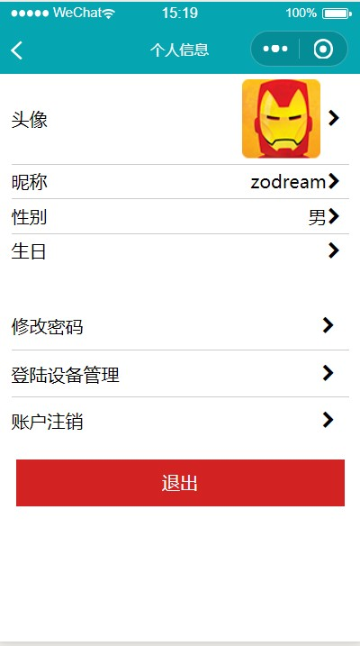

# Mini-Timer
 小程序端时间管理

# 使用方法

配置 `src/config/config.ts` 复制`src/config/config.sample.ts` 内容 即可

## 编译单个文件

借助 Code Runner

在文件编辑框中右键 Run Code 即可编译当前文件 目前仅支持 .ts .vue

具体步骤请参考 【[博客](https://zodream.cn/blog/id/107.html)】

## 预览图

## 相关文章

【[小程序Mini-Timer开发(一)功能介绍](https://zodream.cn/blog/id/108.html)】

【[小程序Mini-Timer开发(二)http封装](https://zodream.cn/blog/id/109.html)】

【[小程序Mini-Timer开发(三)正式测试](https://zodream.cn/blog/id/110.html)】

【[小程序Mini-Timer开发(四)使用说明](https://zodream.cn/blog/id/111.html)】
